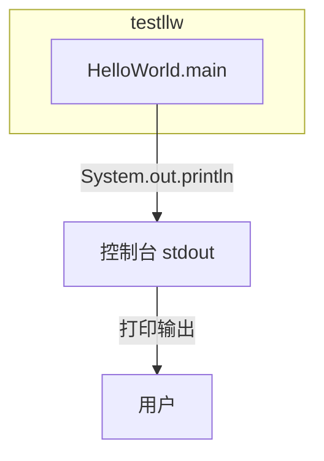
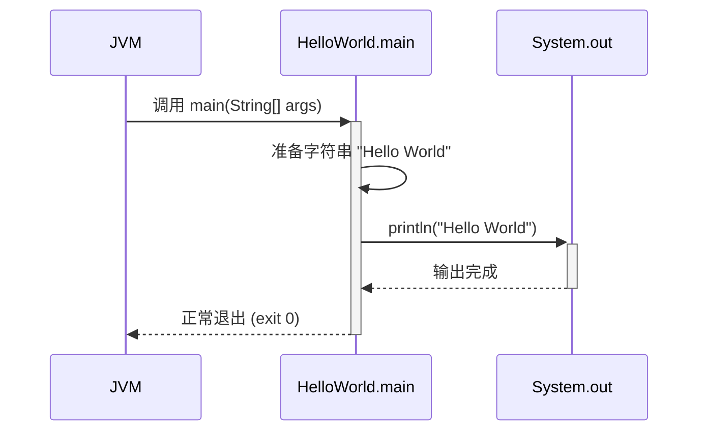

> **文档元信息**
>
> | 项目 | 内容 |
> |------|------|
> | 文档版本 | v1.0 |
> | 作者 | AiWork |
> | 创建日期 | 2026-09-17 |
> | 需求来源 | 工作流任务「写一个 hello world 文件」 |
> | 评审状态 | 待评审 |

# Hello World 系分设计

## 1. 需求与范围

### 背景与目标
- **背景**：新建空白 Java 项目 testllw，需要实现第一个可运行的程序入口。
- **目标**：创建一个标准的 "Hello World" 控制台输出程序，验证 Java 开发环境与项目构建流程正常。

### 核心功能
1. 在控制台输出 "Hello World" 字符串
2. 程序入口 main 方法可正常启动并退出

### 约束与非功能要求
- 遵循 Java 研发工作流标准（Maven 项目结构）
- 输出内容为英文 "Hello World"

### 排除范围
- 不需要 Web 服务、数据库、网络通信
- 不需要用户交互或参数输入
- 不需要单元测试（功能极简，后续测试由 workflow 统一管理）

### 需求功能清单与优先级

| 编号 | 功能点 | 优先级 | PRD 原始描述/章节 | 备注 |
|------|--------|--------|-------------------|------|
| F01 | Hello World 控制台输出 | P0 | "写一个 hello world 文件" | 核心功能 |

### 假设与待确认项

| 编号 | 假设/待确认内容 | 当前假设 | 确认状态 |
|------|-----------------|----------|----------|
| A01 | 项目构建工具 | 假设使用 Maven（依据 workflow.yaml test_command: mvn） | 待确认 |
| A02 | 主类命名 | 假设为 HelloWorld（符合 Java 类名命名规范 PascalCase） | 待确认 |
| A03 | 包名 | 假设为 com.example（无现有包名约定） | 待确认 |
| A04 | 源码目录 | 假设为标准 Maven 布局 src/main/java/com/example/ | 待确认 |

## 2. 架构与模块

### 功能架构

本功能极简，不涉及复杂分层。采用单体 Java 应用架构：

**模块清单**

| 模块 | 职责 | 依赖 |
|------|------|------|
| 入口类 HelloWorld | 程序入口 main 方法，打印 Hello World | 无内部依赖 |

### 应用集成架构

本项不适用，原因：本功能无外部系统集成、无 API 调用、无中间件依赖。

### 部署架构

本项不适用，原因：Hello World 程序为一次性运行的控制台程序，无需部署架构设计。运行方式：`mvn compile exec:java` 或 `java HelloWorld`。

## 3. 数据模型与存储

本项不适用，原因：Hello World 程序不涉及数据库存储，无实体定义，无数据模型需求。

## 4. 接口设计

本项不适用，原因：Hello World 程序为控制台应用，无 oneapi/OpenAPI/内部接口/集成接口设计需求。

## 5. 功能模块设计

### 5.1 HelloWorld 入口类

#### 5.1.1 表结构设计
本项不适用，原因：入口类无需数据库存储。

#### 5.1.2 枚举与常量定义
本项不适用，原因：无状态/类型字段需要枚举定义。

#### 5.1.3 接口详细设计
本项不适用，原因：无 API 接口。

#### 5.1.4 子功能详细设计

##### 5.1.4.1 Hello World 输出（F01）

**处理时序图**

**业务规则**
| 规则编号 | 规则描述 | 校验时机 | 不满足时的处理 |
|----------|----------|----------|--------------|
| R01 | main 方法签名必须为 public static void main(String[]) | 编译时 | 编译错误 |

**异常场景**
| 异常场景 | 处理方式 |
|----------|----------|
| args 参数传递 | 忽略所有参数，始终输出 Hello World |
| 标准输出不可用 | 无（默认终端环境可正常输出） |

**并发控制**
不适用，单线程控制台程序。

**状态机设计**
不适用，无法状态流转。

## 6. 非功能性需求设计

### 6.1 高可用性
本项不适用，原因：控制台单次运行程序，无需高可用设计。

### 6.2 可扩展性
本项不适用，原因：程序极简，无可扩展性要求。

### 6.3 稳定性/可靠性
本项不适用，原因：单输出语句，不存在不稳定场景。

### 6.4 安全性设计
#### 6.4.1 账户系统方案
本项不适用，原因：无用户系统需求。

#### 6.4.2 授权&访问控制
本项不适用，原因：无用户权限需求。

#### 6.4.3 数据防护方案
本项不适用，原因：不涉及敏感数据。

### 6.5 监控/统计/日志/告警
本项不适用，原因：单次运行程序，无需监控体系。

## 7. 变更三板斧

### 7.1 可监控
本项不适用，原因：单次控制台程序，无可监控的运行时服务。

### 7.2 可灰度
本项不适用，原因：无用户流量、无灰度需求。

### 7.3 可应急
本项不适用，原因：无线上服务、无应急回滚需要。代码修改可直接通过 git revert 或重新 push 修复。