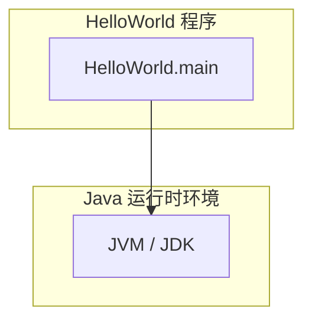
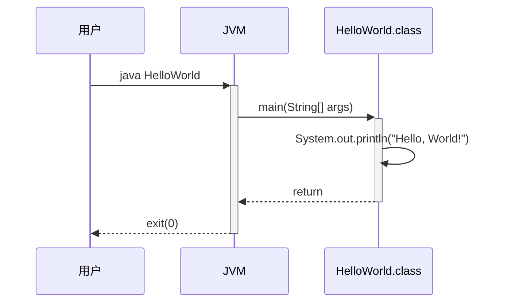

> **文档元信息**
>
> | 项目 | 内容 |
> |------|------|
> | 文档版本 | v1.0 |
> | 作者 | AiWork |
> | 创建日期 | 2026-09-17 |
> | 需求来源 | "实现一个 hello world 的文件" |
> | 评审状态 | 待评审 |

# HelloWorld 系分设计

## 1. 需求与范围
### 背景与目标
实现一个输出 "Hello, World!" 的程序文件。这是一个最基础的入门程序，用于验证开发环境搭建和基本代码运行能力。

**目标**：创建一个可在终端/控制台输出 "Hello, World!" 的程序文件。

### 核心功能
1. 程序运行后向标准输出打印 "Hello, World!"
2. 程序正常退出，返回码 0

### 约束与非功能要求
- 无特定性能要求
- 无安全要求
- 无高可用要求

### 排除范围
- 不涉及 Web 服务
- 不涉及数据库操作
- 不涉及网络通信
- 不涉及多线程/并发处理
- 不涉及用户交互输入

### 需求功能清单与优先级

| 编号 | 功能点 | 优先级 | PRD 原始描述/章节 | 备注 |
|------|--------|--------|-------------------|------|
| F01 | 程序输出 Hello, World! | P0 | "实现一个 hello world 的文件" | 核心功能 |
| F02 | 程序正常退出 | P0 | 隐含需求 | 返回码 0 |

### 假设与待确认项

| 编号 | 假设/待确认内容 | 当前假设 | 确认状态 |
|------|-----------------|----------|----------|
| A01 | 编程语言未指定 | 假设采用 Java（常规企业项目技术栈） | 待确认 |
| A02 | 文件名未指定 | 假设命名为 HelloWorld.java | 待确认 |

## 2. 架构与模块
### 功能架构

本项目为单文件 Hello World 程序，无复杂架构。

**模块清单**

| 模块 | 职责 | 依赖 |
|------|------|------|
| HelloWorld | 程序入口，输出 "Hello, World!" | 无外部依赖，仅需 JDK |

### 应用集成架构
本项不适用，原因：Hello World 为单机运行程序，无外部系统集成。

### 部署架构
本项不适用，原因：Hello World 为本地命令行程序，无需部署架构设计。

## 3. 数据模型与存储

本项不适用，原因：Hello World 程序无需数据存储，不涉及数据库、缓存或消息队列。

## 4. 接口设计

本项不适用，原因：Hello World 为单机命令行程序，不提供对外接口（无 HTTP API、无内部 Service 接口、无外部集成接口）。

## 5. 功能模块设计

### 5.1 HelloWorld 模块

#### 5.1.1 表结构设计

本项不适用，原因：HelloWorld 模块无需数据库存储。

#### 5.1.2 枚举与常量定义

本项不适用，原因：HelloWorld 模块无需枚举或常量定义。

#### 5.1.3 接口详细设计

本项不适用，原因：HelloWorld 模块不对外提供接口。

#### 5.1.4 子功能详细设计

##### 5.1.4.1 程序入口 main 方法（F01）

- **处理时序图**

**业务规则**

| 规则编号 | 规则描述 | 校验时机 | 不满足时的处理 |
|----------|----------|----------|--------------|
| R01 | 输出文本必须为 "Hello, World!" | 运行时 | 无（硬编码输出） |
| R02 | 程序正常退出，返回码为 0 | 运行时 | 无（无异常路径） |

**异常场景**

| 异常场景 | 处理方式 |
|----------|----------|
| JDK 未安装或版本不兼容 | 需运行环境事先安装 JDK 8+，非程序运行时异常 |
| 无异常路径 | 本程序为纯顺序执行，无异常分支 |

**并发控制**

本项不适用，原因：Hello World 为单线程顺序执行，无并发写入。

**状态机设计**

本项不适用，原因：HelloWorld 无状态字段。

## 6. 非功能性需求设计

### 6.1 高可用性
本项不适用，原因：Hello World 为单次运行的命令行程序，无需高可用设计。

### 6.2 可扩展性
本项不适用，原因：Hello World 为单一功能程序，无扩展需求。

### 6.3 稳定性/可靠性
本项不适用，原因：Hello World 无外部依赖，执行路径单一，运行结果完全确定。

### 6.4 安全性设计
本项不适用，原因：Hello World 不涉及用户输入、网络通信或敏感数据处理。

### 6.5 监控/统计/日志/告警
本项不适用，原因：Hello World 为本地命令行程序，无需监控与告警。

## 7. 变更三板斧

### 7.1 可监控
本项不适用，原因：Hello World 程序不部署到生产环境，无需监控埋点。

### 7.2 可灰度
本项不适用，原因：Hello World 程序无需灰度发布。

### 7.3 可应急
本项不适用，原因：Hello World 程序不涉及线上运行，无需应急方案。