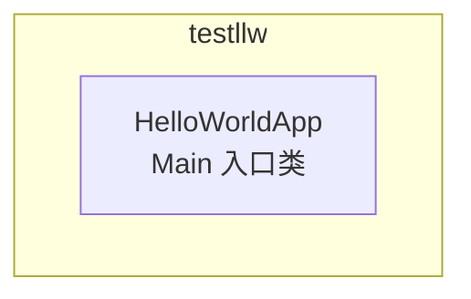
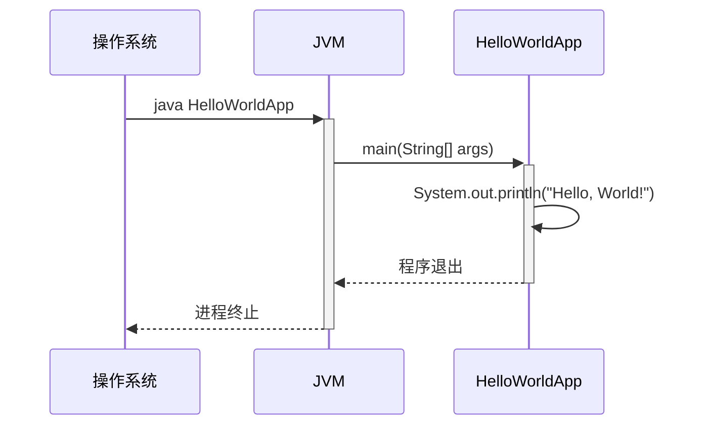

> **文档元信息**
>
> | 项目 | 内容 |
> |------|------|
> | 文档版本 | v1.0 |
> | 作者 | AiWork |
> | 创建日期 | 2026-09-17 |
> | 需求来源 | 写一个 hello world 文件 |
> | 评审状态 | 待评审 |

# Hello World 系分设计

## 1. 需求与范围

### 背景与目标
- **需求描述**：写一个 hello world 文件
- **目标**：在项目中创建一个 Hello World 程序文件，作为项目入口或演示用途
- **使用方**：开发人员/项目初始化验证

### 核心功能
1. 创建一个可运行的 Hello World 程序，输出 "Hello, World!" 信息

### 约束与非功能要求
- 遵循项目现有编码规范（Java）

### 排除范围
- 不涉及 Web 界面
- 不涉及数据库操作
- 不涉及外部服务集成
- 不涉及权限/认证

### 需求功能清单与优先级

| 编号 | 功能点 | 优先级 | PRD 原始描述/章节 | 备注 |
|------|--------|--------|-------------------|------|
| F01 | Hello World 程序实现 | P0 | 写一个 hello world 文件 | 核心功能，唯一需求 |

### 假设与待确认项

| 编号 | 假设/待确认内容 | 当前假设 | 确认状态 |
|------|-----------------|----------|----------|
| A01 | 未指定 Java 包名结构 | 假设使用默认包或采用 `com.example` 命名空间 | 待确认 |
| A02 | 未指定输出方式 | 假设标准控制台输出 | 待确认 |
| A03 | 未指定文件位置 | 假设放在 `src/main/java` 下 | 待确认 |

## 2. 架构与模块

### 功能架构
由于需求极简（仅 hello world），无需分层架构。应用结构如下：

**模块清单**

| 模块 | 职责 | 依赖 |
|------|------|------|
| HelloWorld 模块 | 实现控制台输出 "Hello, World!" | 无外部依赖 |

### 应用集成架构
本需求不涉及外部系统集成，不涉及中间件服务。

### 部署架构
单机运行，无需分布式部署。

## 3. 数据模型与存储

### 实体清单
本项不适用，原因：hello world 不涉及业务实体，无需数据存储。

### 实体关系图
本项不适用，原因：无实体。

## 4. 接口设计

### 4.1 oneapi（Web 控制台接口）
本项不适用，原因：无 Web 控制台接口需求。

### 4.2 OpenAPI（对外接口）
本项不适用，原因：不对外提供 API 服务。

### 4.3 内部接口（Service 层）
本项不适用，原因：单体 main 类，无 Service 层接口。

### 4.4 集成接口（Integration 层）
本项不适用，原因：不涉及外部系统集成。

## 5. 功能模块设计

### 全局约定
- 错误码格式：不适用（无接口调用）
- 通用出参结构：不适用（无接口调用）

### 5.1 HelloWorld 模块

#### 5.1.1 表结构设计
本项不适用，原因：无数据持久化需求。

#### 5.1.2 接口详细设计
本项不适用，原因：无 API 接口。

#### 5.1.3 子功能详细设计

##### 5.1.3.1 HelloWorld 程序入口（F01）

**处理时序图**

**业务规则：**
| 规则编号 | 规则描述 | 校验时机 | 不满足时的处理 |
|----------|----------|----------|--------------|
| R01 | 无输入校验要求 | 不适用 | 不适用 |

**异常场景：**
| 异常场景 | 处理方式 |
|----------|----------|
| 无（标准输出无需特殊异常处理） | 默认 JVM 异常处理 |

**并发控制：**
本项不适用，原因：单次进程执行，无并发场景。

**状态机设计：**
本项不适用，原因：无状态字段。

## 6. 非功能性需求设计

### 6.1 高可用性
本项不适用，原因：hello world 为一次性运行程序，非服务型应用，无需高可用设计。

### 6.2 可扩展性
本项不适用，原因：功能单一，无扩展需求。

### 6.3 稳定性/可靠性
本项不适用，原因：标准库输出无稳定性风险。

### 6.4 安全性设计
#### 6.4.1 账户系统方案
本项不适用，原因：无用户交互，无需账户系统。

#### 6.4.2 授权与访问控制
本项不适用，原因：无权限控制需求。

#### 6.4.3 数据防护方案
本项不适用，原因：不处理敏感数据。

### 6.5 监控/统计/日志/告警
本项不适用，原因：一次性程序，无需监控告警。

## 7. 变更三板斧

### 7.1 可监控
本项不适用，原因：hello world 为一次性控制台程序，无运行时监控需求。

### 7.2 可灰度
本项不适用，原因：功能发布无需灰度。

### 7.3 可应急
本项不适用，原因：无在线服务，回滚即删除文件，无上下游依赖。